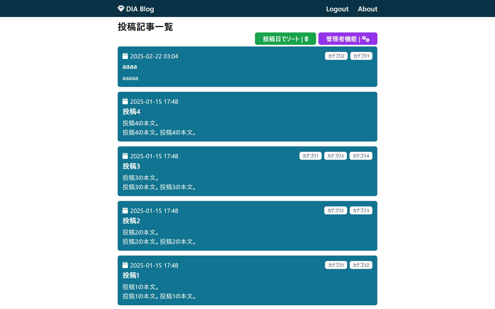
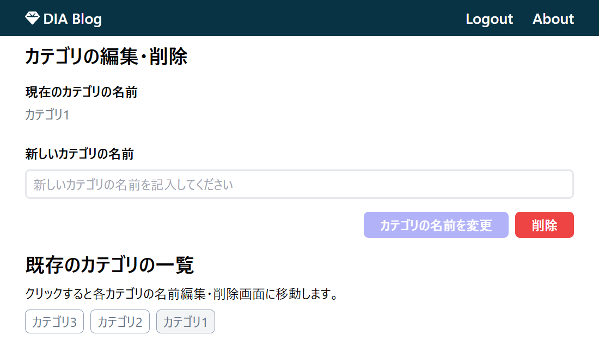

# DIA Blog

## 概要

- アプリ名: "DIA Blog"
- このアプリは、普段の生活や日常の中で起こった出来事の記録や日記等、考えたことや感じたことを様々な人に共有することを主な使用用途とし、一般の人々を対象としている。
- "DIA Blog"というアプリ名は、宝石、鉱石のダイヤモンドの"**Dia**mond"と、日記を意味する"**Dia**ry"に由来する。

## 開発の背景・経緯

- 開発者は以前にウェブブラウザで実行されるフロントエンド部分のみで完結する Todo アプリの開発を通じ、「React」を使ったモダンウェブ開発の基礎について学んだ。今回開発を行ったこのアプリは、Next.js をフレームワークとして使用し、サーバ上で実行されるバックエンド部分を含めた「本格的なモダンウェブアプリ開発」 について体験的に学ぶことを目的としている。

## 公開 URL

https://next-blog-app-megumegu256.vercel.app/

## 特徴と機能の説明

### ヘッダー

- どのページに移動しても表示され続ける、画面上部にある枠部分。"DIA Blog"、"Login"、"About"の 3 つの文字が表示されており、クリックするとそれぞれページに移動する。
- "DIA Blog"をクリックした場合、公開 URL にアクセスすると表示される["投稿記事一覧"ページ](#投稿記事一覧ページ)に移動する。
- "Login"をクリックした場合、["ログイン"ページ](#ログインページ)に移動する。すでにログインを行っていた場合、この文字は"Logout"と表示され、クリックするとログアウトすることができ、再度"Login"と表示される。
- "About"をクリックした場合、["About"ページ](#aboutページ)に移動し、開発者のプロフィールを閲覧することができる。

### "ログイン"ページ

- 他のページを閲覧する際、ログインが要求された場合に表示されるページ。
- すでにログインが完了していた場合は表示されない。
- ここではテキストフィールド"ログイン ID (email)"、パスワードフィールド"パスワード"と、"ゲストアカウント情報入力"、"ログイン"ボタンが表示される。
- "ゲストアカウント情報入力"ボタンをクリックすると、"ログイン ID (email)"、"パスワード"のフィールドにゲストアカウントの情報が入力される。今回のアプリでは、ログイン ID、パスワード共に事前に開発者が登録したアカウント情報"*admin@example.com*"が入力される。
- "ログイン"ボタンをクリックした際、"ログイン ID (email)"、"パスワード"のフィールド共にゲストアカウント情報"*admin@example.com*"が入力されていた場合、["管理者用機能の一覧"ページ](#管理者用機能の一覧ページ)に移動することができる。適切な情報が入力されていなかった場合は、画面に"ログイン ID またはパスワードが違います (invalid_credentials)"と表示され、ログインすることができない。

### "About"ページ

- 開発者のプロフィールを閲覧することができるページ。
- イメージアイコン、名前、ポートフォリオの URL が記載されている。

### "投稿記事一覧"ページ

- 公開 URL にアクセスすると表示されるページ。
- ここでは現在投稿されている記事それぞれの投稿年月日、タイトル、本文、カテゴリが表示される。
- それぞれの記事のタイトルや分をクリックすると、その["記事"ページ](#記事ページ)に移動できる。
- "投稿時間でソート"ボタンをクリックすると、現在表示されている記事の投稿時間について並び変えることができる。ボタンをクリックするたびに、昇順、降順を切り替えることができる。
- "管理者機能"ボタンをクリックした際、ログインが完了していない場合は"ログイン"ページに移動するが、ログインが完了していた場合は["管理者用機能の一覧"ページ](#管理者用機能の一覧ページ)に移動する。

### "記事"ページ

- 投稿されている記事の内容が閲覧できるページ。
- タイトル、イメージ画像、本文が表示される。

### "管理者用機能の一覧"ページ

- 投稿記事に関する設定を行うページがまとめられているページ。
- "/admin/posts - 投稿記事の管理"をクリックで["投稿記事の管理"ページ](#投稿記事の管理ページ)、"/admin/posts/new - 投稿記事の新規作成"をクリックで["投稿記事の新規作成"ページ](#投稿記事の新規作成ページ)、"/admin/categories - カテゴリの管理"をクリックで["カテゴリの管理"ページ](#カテゴリの管理)、"/admin/categories/new - カテゴリの新規作成"をクリックで["カテゴリの新規作成"ページ](#カテゴリの新規作成ページ)に移動することができる。
- ログインが完了していなかった場合はこのページが表示されず、["ログイン"ページ](#ログインページ)が表示される。

### "投稿記事の管理"ページ

- ここでは現在投稿されている記事それぞれの投稿年月日、タイトル、本文、カテゴリが表示される。
- それぞれの記事のタイトルや文をクリックすると、その["記事"ページ](#記事ページ)に移動できる。
- "投稿時間でソート"ボタンをクリックすると、現在表示されている記事の投稿時間について並び変えることができる。ボタンをクリックするたびに、昇順、降順を切り替えることができる。
- 表示されているカテゴリをクリックすると、その["カテゴリの編集・削除"ページ](#カテゴリの編集・削除ページ)に移動することができる。
- "編集"ボタンをクリックすると、その記事の["投稿記事の編集・削除"ページ](#投稿記事の編集・削除ページ)に移動することができる。
- "削除"ボタンをクリックすると、ポップアップウィンドウが表示され、その記事の削除を行うことができる。
- ログインが完了していなかった場合はこのページが表示されず、["ログイン"ページ](#ログインページ)が表示される。

### "投稿記事の編集・削除"ページ

- "タイトル"、"本文"、"カバーイメージ (URL)"のテキストフィールドと、カテゴリの"タグ"のチェックボックスが表示され、直前の操作で選択した記事の内容が反映される。
- "記事を更新"ボタンで変更内容の反映、"削除"ボタンで記事の削除を行うことができる。
- ログインが完了していなかった場合はこのページが表示されず、["ログイン"ページ](#ログインページ)が表示される。

### "投稿記事の新規作成"ページ

- "タイトル"、"本文"、"カバーイメージ (URL)"のテキストフィールドと、カテゴリの"タグ"のチェックボックスが表示され、新規で投稿する記事の内容を編集できる。
- "記事を投稿"ボタンで編集通りの記事が新規投稿される。
- ログインが完了していなかった場合はこのページが表示されず、["ログイン"ページ](#ログインページ)が表示される。

### "カテゴリの管理"

- ここでは現在設定されているカテゴリそれぞれの名前が表示される。
- カテゴリそれぞれの名前や"編集"ボタンをクリックすると、その記事の["投稿記事の編集・削除"ページ](#投稿記事の編集・削除ページ)に移動することができる。
- "削除"ボタンをクリックすると、ポップアップウィンドウが表示され、そのカテゴリの削除を行うことができる。
- ログインが完了していなかった場合はこのページが表示されず、["ログイン"ページ](#ログインページ)が表示される。

### "カテゴリの編集・削除"ページ

- テキスト"現在のカテゴリの名前"、テキストフィールド"新しいカテゴリの名前"、"カテゴリの名前を変更"ボタン、"削除"ボタンが表示される。
- "カテゴリの名前を変更"ボタンがクリックされると、テキストフィールド"新しいカテゴリの名前"に入力された内容でカテゴリの名前を変更し、"削除"ボタンがクリックされると、カテゴリを削除することができる。
- また、クリックすると各カテゴリの["カテゴリの編集・削除"ページ](#カテゴリの編集・削除ページ)に移動する"既存のカテゴリの一覧"が表示される。
- ログインが完了していなかった場合はこのページが表示されず、["ログイン"ページ](#ログインページ)が表示される。

### "カテゴリの新規作成"

- テキストフィールド"名前"と"カテゴリを作成"ボタンが表示されている。
- "カテゴリを作成"ボタンをクリックすると、テキストフィールド"名前"に入力された内容でカテゴリを新規作成することができる。
- また、クリックすると各カテゴリの["カテゴリの編集・削除"ページ](#カテゴリの編集・削除ページ)に移動する"作成されたカテゴリの一覧"が表示される。
- ログインが完了していなかった場合はこのページが表示されず、["ログイン"ページ](#ログインページ)が表示される。

## 使用技術 (技術スタック)

### 使用した言語やフレームワーク

- TypeScript:
  - JavaScript に型安全性を追加したプログラミング言語。
- Next.js:
  - React ベースのフルスタックフレームワーク。
- Prisma:
  - データベースとのやり取りをサポートする ORM (Object-Relational Mapping)。

### ライブラリ

- @fortawesome/fontawesome-svg-core:
  - FontAwesome の SVG アイコンを使用するためのコアライブラリ。
- @fortawesome/free-solid-svg-icons:
  - FontAwesome の無料のソリッドアイコンセット。
- @fortawesome/react-fontawesome:
  - React で FontAwesome アイコンを使用するためのコンポーネント。
- @prisma/client:
  - Prisma のクライアントライブラリ。データベースとのやり取りを簡単にするための ORM。
- @supabase/supabase-js:
  - Supabase の JavaScript クライアントライブラリ。認証やデータベース操作を行うために使用。
- crypto-js:
  - JavaScript で暗号化やハッシュ化を行うためのライブラリ。
- isomorphic-dompurify:
  - サーバーサイドとクライアントサイドの両方で DOMPurify を使用するためのライブラリ。
- next:
  - Next.js フレームワーク。React ベースのサーバーサイドレンダリングと静的サイト生成をサポート。
- react:
  - ユーザーインターフェースを構築するための JavaScript ライブラリ。
- react-dom:
  - React の DOM 操作ライブラリ。React コンポーネントを DOM にレンダリングするために使用。

### ツールやウェブサービス

- VSCode:
  - コードエディタとして使用。
- Supabase:
  - バックエンドのデータベース・認証管理のため使用。
- Vercel:
  - デプロイ・ホスティングのため使用。

## 開発期間・体制

- 開発体制: 個人開発
- 開発期間: 2024.12 ~ 2025.2 (約 52 時間)

## 工夫した点

- それぞれの記事やカテゴリのタブの背景色をヘッダーと同系色で鮮やか過ぎない色に設定することで見やすさを重視し、テーマをある程度統一した Web サイトになるよう、UI のデザインを工夫をした。
- 新規作成ボタンや、編集ボタン、削除ボタンの色は、それぞれの機能に持つイメージの色に設定することで、わかりやすさを意識したデザインとなっている。特に、削除ボタンの赤色は慎重な操作を推奨するためである。
- これらのボタンにはイメージのあったイラストアイコンを表示しており、新規作成ボタンであれば＋、編集ボタンであれば鉛筆、削除ボタンであれば消しゴムのアイコンを表示している。今回は FontAwesome というモジュールサービスを使用した。

## 改良・改善

- サインイン・アカウント作成機能を実装する。
- "投稿記事一覧"ページの記事を一度に多く表示するため、表示される記事のサイズを小さくし、さらにフレックスボックスを扱った配置にしたい。

## ポートフォリオ URL

https://megumegu256.github.io/portfolio/portfolio.html
